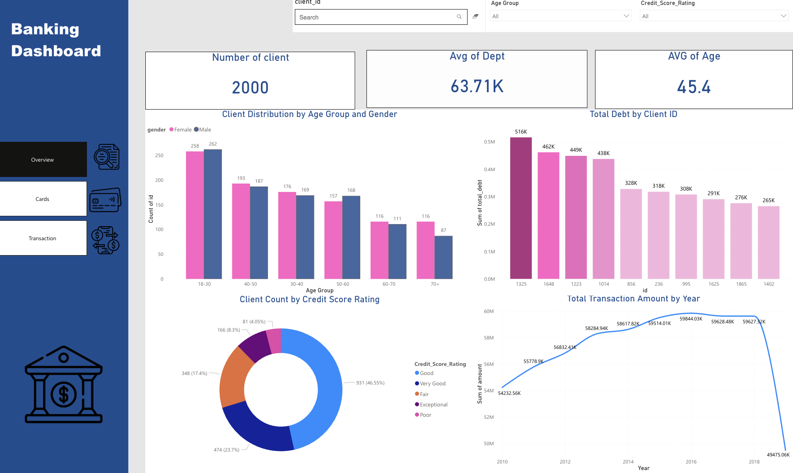
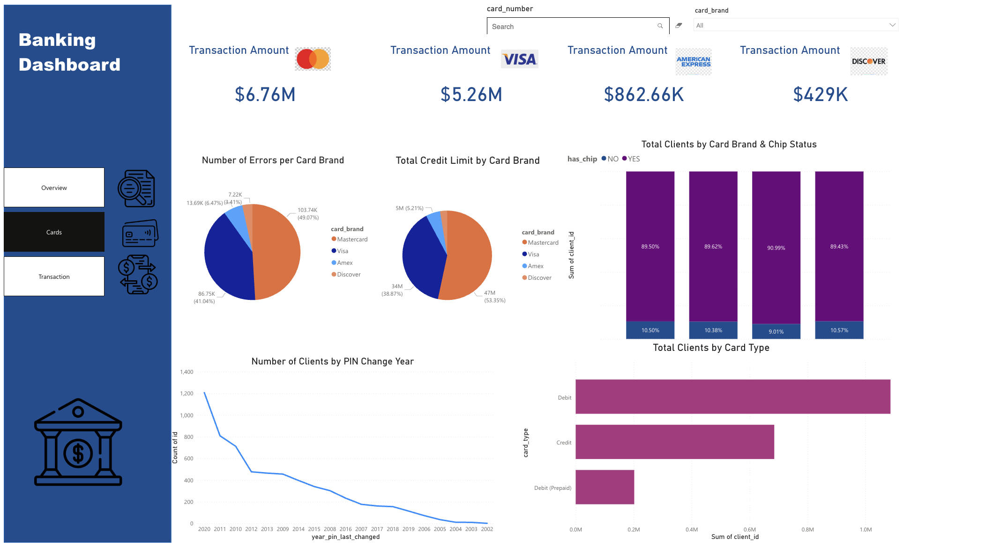
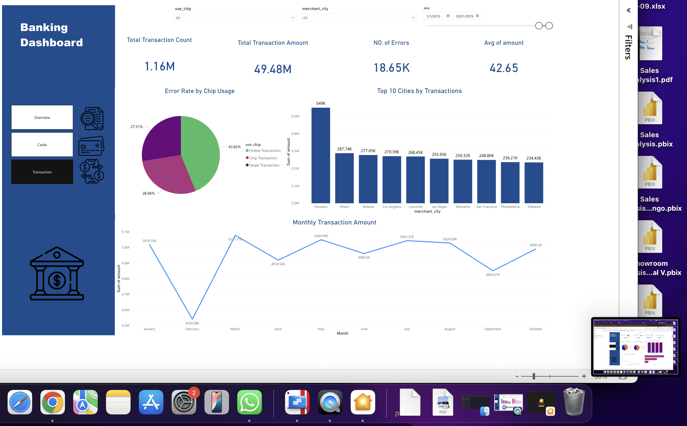

# Banking Analytics Dashboard (Power BI)

A **Power BI** dashboard for analyzing banking customers, cards, and transactions. The goal is to highlight usage patterns, error behavior, credit limits, and track KPIs over time to support decision-making.

[⬇️ Download Dashboard (v2025.08)](https://github.com/layanbalbeisi/bank-analytics-powerbi/releases/download/2025.08/bank.Dashboard.pbix)
&nbsp;•&nbsp;
[⬇️ Latest Release](https://github.com/layanbalbeisi/bank-analytics-powerbi/releases/latest/download/bank.Dashboard.pbix)

---

## ✨ Key Features
- **Overview:** Snapshot of total customers, gender distribution, annual income, average age, average credit score, average capita income, and number of customers with debt.
- **Cards:** Analysis by card brand/type (MasterCard, Visa, Discover …), credit limits, error counts, and chip usage.
- **Transactions:** Transaction trends by years, top-spending cities, monthly amounts, and error rate by chip usage.
- **Demographics (optional):** Customer distribution by age group and gender, plus credit score rating segmentation.

## 🧩 Notable Insights
- **MasterCard** is the most used brand, yet shows a **higher error rate** compared to others → consider device/process tightening or stronger verification policies.
- **Top-spending cities:** Spending is concentrated in specific cities → target offers and campaigns accordingly.
- **Seasonality:** Differences across **2016–2019** suggest behavioral/economic changes → consider aligning time windows or applying seasonal modeling.
- **Credit Score Mix:** A sizable “medium/low” segment → opportunities for eligibility uplift and risk reduction programs.

## 📹 Overview Page


## 📹 Cards Page


## 📹 Transaction Page


---
---

## 📊 Sample DAX Measures
```DAX
-- Total Transactions
[Total Transactions] = COUNTROWS('transactions_data')
```
```DAX
-- Total Customers
[Total Customers] = DISTINCTCOUNT('clients_data'[client_id])
```
```DAX
-- Average Credit Score
[Avg Credit Score] = AVERAGE('clients_data'[credit_score])
```
```DAX
-- MasterCard Transactions
[MC Transactions] =
CALCULATE(
    [Total Transactions],
    FILTER(ALL('cards_data'), 'cards_data'[card_brand] = "MasterCard")
)
```
```DAX
-- Visa
[Visa Transactions] =
CALCULATE(
    [Total Transactions],
    FILTER(ALL('cards_data'), 'cards_data'[card_brand] = "Visa")
)
```
```DAX
-- American Express
[American Express Transactions] =
CALCULATE(
    [Total Transactions],
    FILTER(ALL('cards_data'), 'cards_data'[card_brand] = "American Express")
)
```
```DAX
-- Discover
[Discover Transactions] =
CALCULATE(
    [Total Transactions],
    FILTER(ALL('cards_data'), 'cards_data'[card_brand] = "Discover")
)
```
```DAX
-- Error Rate (Chip = Yes)
[Error Rate by Chip] =
DIVIDE(
    CALCULATE(COUNTROWS('transactions_data'), 'transactions_data'[error_flag] = 1, 'transactions_data'[use_chip] = "Yes"),
    CALCULATE(COUNTROWS('transactions_data'), 'transactions_data'[use_chip] = "Yes")
)
```
```DAX
-- Avg Transactions per Customer
[Avg Tx per Customer] = DIVIDE([Total Transactions], [Total Customers])
```
